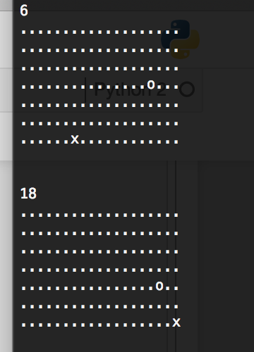

# ASCII-Single-Player-Pong
Pong played with ascii characters. Boring, but instructive. Just hitting walls.

Hitting walls with your 'x', and the ball being an 'o' character. 
If the ball is not in the 'x''s location on the next turn then it raises an error i.e. you lose.

Score count can be easily added if desired.

